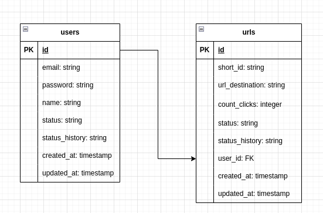

# Shortener URL

O projeto esta hospeda no serviço de Cloud [Render](https://render.com/). O endereço do projeto é [Shortener-URL](https://shortener-url-ge5k.onrender.com).
## 1 Criar arquivo com variaveis de ambiente para desenvolvimento.
Para executar o projeto em dev, devemos criar o arquivo com as variaveis de ambiante. 

``touch .env.dev``

Colocar o conteúdo abaixo no arquivo criado.
```
NODE_ENV=development
ENV=dev
DB_PASSWORD=senha.development
DB_USER=dev
DB_HOST=localhost
DB_PORT=5432
DB_CLIENT=pg
DB_NAME=shortener-url
HOST_PORT=8080
ENV_FILE=.env.dev
API_PORT=3000
URL_HOST=localhost:3000
TOKEN_SECRET=a6670c0fbbc737ac013e4a25011be88969768a21ec58ab2cdc0296fe423391f60e64f3a1fe9191b8c412ee7d42bc999b4139a9d2b9ba2143ae2101465dd91d71
```
### 1.1 Criando as tabelas necessarias
Subindo o banco de dados Postgres usando o docker.

``docker build .``

Depois executamos.

``npm run db:dev:up``

Executando as migrações.

``npm run knex:dev migrate:latest``

Com uma resposta positiva, devemos ter essa estrutura da tabelas.



Pronto, basta executar o comando abaixo e o serviço já esta disponvel para usar.

``npm run dev``

## 2 Subindo o projeto de desenvolvimento localmente.

Para utilizar o serviço localmente, devemos executar o comando abaixo para fazer build e executar o docker compose.

``npm run local:up``

Verificar containers ativos:

``docker container ls``

Entrar no container do app.

``docker exec -it CONTAINER_ID sh``

Executar migrations.

``npm run knex:local migrate:latest``

Basta reinicar o container.

``docker container restart CONTAINER_ID`

Pronto, o serviço esta disponivel na na porta 3000.

## Documentação da API 
* [1. Criação de Usuario e Autenticação ](./docs/auth.md)
* [2. Criar e manipular URLs curtas](./docs/urls.md)